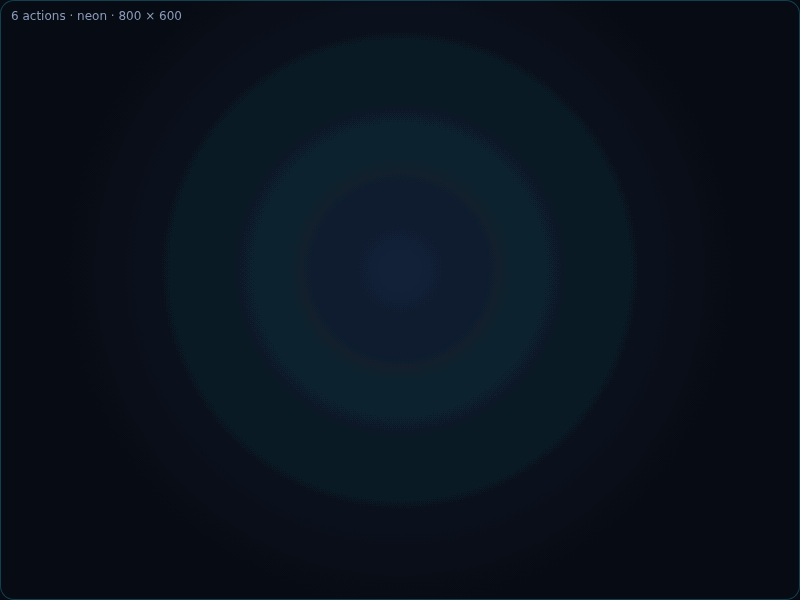
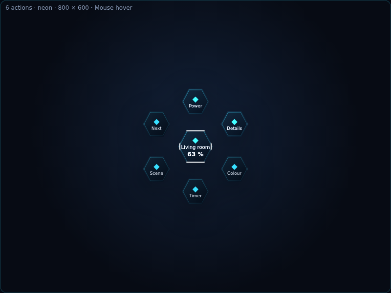
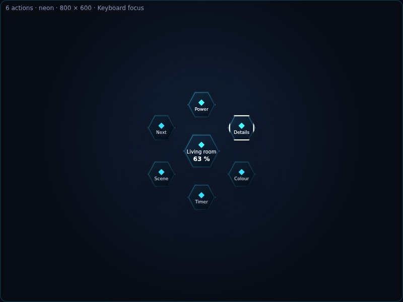
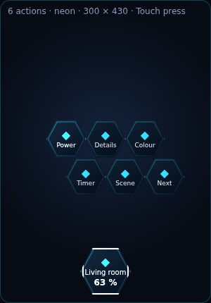
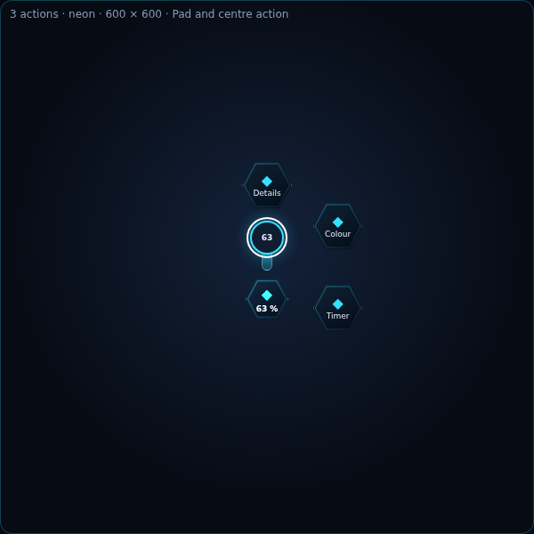
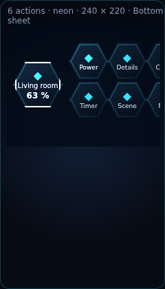

# Neon Honeycomb: baseline, clean-room record and acceptance notes

This document records the implementation decisions behind Neon Honeycomb. It is intentionally based on observed public behaviour and NeonPlan's existing runtime paths, not on source or CSS from the reference project.

## Clean-room boundary and attribution

The interaction idea is inspired by [Honeycomb Menu for Home Assistant](https://github.com/Sian-Lee-SA/honeycomb-menu), by Sian-Lee-SA. The reference repository is GPLv3. Neon Honeycomb is a new MIT implementation written with NeonPlan's existing Lit runtime, Home Assistant helpers and design tokens.

No JavaScript, CSS, template engine, `custom:button-card`, lodash, Lit copy, `HCJS` parser or bundled asset from the reference project is used. In particular, persisted configuration stays typed and serializable and no string is evaluated as JavaScript.

The public visual references were pinned on 2026-10-09 to reference commit `16a2ac09a98c6837cb092603696e97e3a6102b45`:

- [Six-cell opening/closing example](https://raw.githubusercontent.com/Sian-Lee-SA/honeycomb-menu/16a2ac09a98c6837cb092603696e97e3a6102b45/examples/example-1.gif)
- [XY pad example](https://raw.githubusercontent.com/Sian-Lee-SA/honeycomb-menu/16a2ac09a98c6837cb092603696e97e3a6102b45/examples/example-xypad.gif)
- [Public demonstration video](https://www.youtube.com/watch?v=oJ9Yr2dSqUk)

These links are the saved reference manifest; the GPL media is not copied into the MIT source tree. Review at 1× playback in an 800 × 600 reference stage. Compare the opening at 0%, 25%, 50%, 75% and 100%, starting at the top cell and proceeding clockwise. The Neon fixture exposes the same pauses with `npm run honeycomb` (port 4174) and `?pause=0`, `25`, `50`, `75` or `100`; `?low` exercises Low/Tablet rendering.

The resulting Neon motion record is generated from those five committed checkpoints:

## Runtime baseline locked before migration

| Group | Reachable before Honeycomb | Service and policy baseline | New capability, if any |
|---|---|---|---|
| Light | Tap toggles; hold opens quick menu | `light.toggle`; eight RGB swatches or six Kelvin values; `light.turn_on` with `brightness_pct`; placement confirm applies only to power | Typed pagination preserves all eight colours; vertical brightness pad |
| Cover | Tap or hold opens quick menu | Open, 75/50/25, close, stop and position; placement confirm applies to movement, never stop; details closes, other actions keep the menu open | Position pad and a separate tilt page |
| Switch | Tap toggles; hold opens quick menu | Existing toggle helper, state, placement confirm | None |
| Fan | Hold opens the common toggle branch | Existing toggle behaviour | Percentage, preset and oscillation only when `supported_features` and attributes prove support |
| Lock | Hold opens quick menu | `lock.lock`/`lock.unlock`; placement confirm was optional | Deliberate safety change: every unlock requires confirmation |
| Camera | Tap or hold opens quick menu | Snapshot/details and local look-through, with the existing Pro gate | Typed local command; unavailable still exposes details |
| Media player | Renderer existed but hold did not reach it | Previous, next, play/pause, volume, source and preset services | Hold route enabled; source/preset pagination and throttled volume pad |
| Climate | More-info only | No quick-menu service baseline | Capability-driven HVAC modes and release-commit target-temperature pad |
| Car Pro | Hold on a linked parking/car entity | Lock, climate and charging can target entities other than the anchor | Target is represented explicitly and unlock always confirms |

The baseline and the new policies are asserted in `frontend/src/neon-menu.test.ts`. More-info and camera look close the overlay. Page changes, pads, power, palette and device services keep it open, matching the useful persistence of the classic control surface; backdrop and Escape close it.

## Page rules

- Each page has one centre and no more than six outer cells.
- Light keeps power and details on the main page. Colour/Kelvin entries use four data cells plus previous/next navigation when needed, so eight colours are never truncated.
- Cover keeps open, 75, 50, close, 25 and stop on the first ring. Tilt gets a separate page reached from the centre; details remains on the tilt page. Position and tilt pads send their final value on release.
- Fan presets, climate HVAC/fan modes, media sources and media presets use the same deterministic four-data-cell pagination. Changing page never dispatches a Home Assistant service.
- Unknown actions, unsafe service names, non-local navigation paths and unknown local commands are rejected before dispatch.

## Visual and input acceptance

The geometry and motion constants live in `frontend/src/neon-menu.ts`: 56 px outer targets, 72 px centre, a 92 px radius, 60° spacing, 160 ms per cell, 45 ms stagger, 0.72 start scale and 0.92 press scale. Unit tests lock these values to the roadmap ranges and lock the five golden-frame progress points.

The component uses a dialog semantic, keeps focus inside while open, restores the opener, supports Escape and arrow keys, prevents click-through, and exposes pad values as a slider. Pointer capture is held by the actual pad surface and cancelled on pointer cancellation, loss of capture or disconnect; a final commit is emitted for every completed or cancelled gesture. Reduced motion removes stagger/translation and limits the fade to 80 ms. Low/Tablet removes the multi-layer drop shadow. Narrow or obstructed stages first dock the six actions in a compact 3 × 2 honeycomb above the centre control. If the stage is still too small, a contained, scrollable bottom sheet preserves every touch target at 48 px or larger.

### Input examples

| Mouse hover | Keyboard focus | Touch press on narrow dock |
|---|---|---|
|  |  |  |

The pad keeps the centre action available, and the smallest-stage fallback uses a bottom sheet:

| Pad and centre action | Compact bottom sheet |
|---|---|
|  |  |

## Verification matrix

- Node unit tests: builder capability mapping, exact service/data/target, confirm, pagination, invalid input, layout clamp, geometry, motion and unavailable behaviour.
- Development fixture: 1/3/6 cells, multiple pages, all four stage corners, narrow/panel dock, compact bottom sheet, Low/Tablet, and 0/25/50/75/100 animation pauses.
- `npm run honeycomb:golden`: Chrome browser acceptance plus 45 frames covering desktop/tablet/narrow × 1/3/6 actions × five animation checkpoints.
- `npm run honeycomb:browser`: the same geometry, keyboard, pagination, pointer-pad, timing and FPS suite in Chromium or Firefox selected through `BROWSER_EXECUTABLE`.
- `npm run honeycomb:webkit`: WebKit geometry, keyboard, pagination, pad and Low/Tablet checks with a Playwright WebKit installation.
- `npm run honeycomb:media`: reproducibly rebuilds the documentation GIF from the committed desktop golden frames.

The recorded 2026-10-09 matrix is in [`browser-matrix.json`](assets/neon-honeycomb/browser-matrix.json): Chrome 148 and Firefox 157 passed the full suite; WebKit 26 passed layout and interaction checks. Chrome Low/Tablet measured 39 shadow-DOM nodes, an opening completion within the 450 ms budget, about 60 FPS, and a throttled pad stream with a final commit. Android Companion and Fire Tablet profiles were exercised with coarse-pointer/touch emulation, their respective viewport/user-agent shapes and no stage overflow. The WebKit WPE headless frame clock is software/offscreen and is recorded for diagnostics, not treated as physical Safari FPS.

A static screenshot proves geometry only. Timing acceptance uses actual `animationend` timestamps as well as computed tokens. The reference GIF and the generated Neon GIF were reviewed at 1×: both reveal the centre first and expand the surrounding cells outward; Neon deliberately keeps its clockwise stagger, dark glass palette and tighter 385 ms token timeline rather than copying the reference styling.
