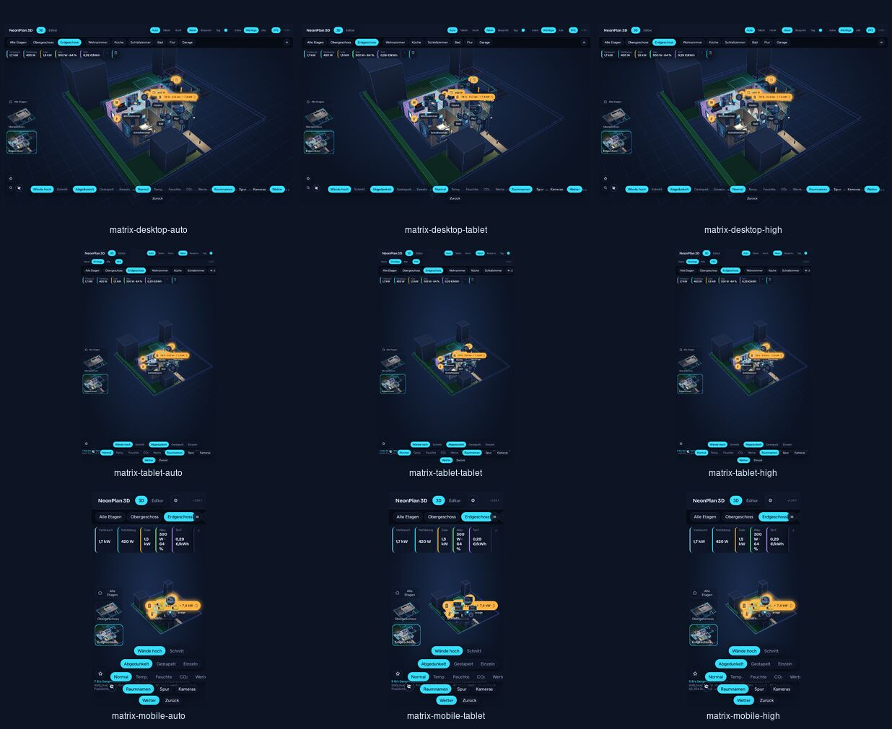

# Ma trận kiểm thử thiết bị và chất lượng

Ngày chạy gần nhất: **09/10/2026**, trên Chromium Headless 127 với WebGL/SwiftShader. Đây là smoke test tái tạo được cho responsive layout và pipeline render; không thay thế đo nhiệt/pin trên phần cứng vật lý.



## Phạm vi và kết quả

Trong mã, tier tiết kiệm có giá trị `low` và nhãn UI **Tablet**. Ba tier được kiểm là Auto, Tablet/Low và High.

| Viewport | Auto | Tablet / Low | High | Canvas được xác nhận |
|---|---:|---:|---:|---:|
| Desktop 1440 × 900 | Đạt | Đạt | Đạt | 1440 × 780 |
| Tablet dọc 800 × 1280 | Đạt | Đạt | Đạt | 800 × 1124 |
| Điện thoại 420 × 800 | Đạt | Đạt | Đạt | 420 × 680 |

Mỗi ca kiểm thử:

- tải plan demo, chuyển sang tầng trệt và đợi WebGL ổn định;
- gán chính xác `quality` tương ứng rồi assert trạng thái viewer (`low=true` cho Tablet; `high=true` và `low=false` cho High);
- assert canvas có kích thước khác 0 và khớp vùng hiển thị responsive;
- chụp ảnh, sau đó kiểm tra trực quan thanh tầng, thẻ năng lượng, thumbnail tầng, nhãn phòng, model nội thất và thanh điều khiển dưới;
- thu lỗi console/runtime. Không có exception hay lỗi WebGL; hai 404 lặp lại ở mỗi ca là tài nguyên pack riêng không có trong checkout công khai, giống baseline đã ghi nhận.

## Cách chạy lại

Sau `npm --prefix frontend run build`, đặt đường dẫn Chrome/Chromium và chạy:

```bash
SHOTS=matrix-desktop-auto,matrix-desktop-tablet,matrix-desktop-high,matrix-tablet-auto,matrix-tablet-tablet,matrix-tablet-high,matrix-mobile-auto,matrix-mobile-tablet,matrix-mobile-high \
  npm --prefix frontend run screenshot -- /tmp/neonplan3d-device-matrix
```

Harness sẽ dừng với lỗi nếu tier không được áp dụng hoặc canvas không dựng được. Các định nghĩa viewport và assertion nằm trong `frontend/screenshot.mjs`.
